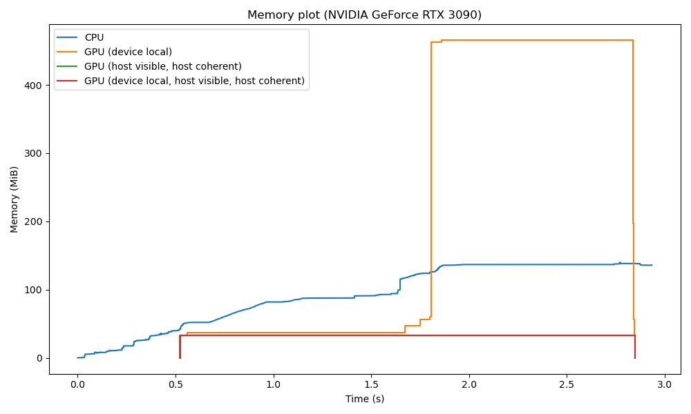

# VkLayer_memstats

A Vulkan layer for dumping memory statistics.

When using the layer, memory statistics will be dumped to a file called memstats.csv. The layer can either only dump
Vulkan memory statistics, or also CPU memory allocations.




## How to build

```shell
git submodule update --init --recursive

# Linux
cmake -B build -S . -DCMAKE_BUILD_TYPE=Release
cmake --build build -j $(nproc)

# Windows
cmake -B build -S .
cmake --build build --config Release -j 8
```

To further enable CPU memory allocation statistics dumping, append the options below to the CMake configure step.
- Linux: Append `-DHOOK_MALLOC=ON` to hook `malloc`/`free`/`calloc`/`realloc`.
- Windows (recommended): Append `-DUSE_DETOURS=ON` to use [Detours](https://github.com/microsoft/Detours).
  This is the recommended option for Windows, as a preload helper executable is provided for Detours, but not MinHook.
- Windows (alternative): Append `-DUSE_MINHOOK=ON` to use [MinHook](https://github.com/TsudaKageyu/minhook).


## Usage on Linux (Vulkan-only)

Vulkan changed how layer configuration works for loaders built against the 1.3.234 Vulkan headers or later.
For more details, please refer to
https://github.com/KhronosGroup/Vulkan-Utility-Libraries/blob/main/docs/layer_configuration.md.
If using a recent Vulkan loader, the environment variables below can be used to enable the layer.

```shell
export VK_ADD_LAYER_PATH=<PATH_TO_BUILD>
export VK_LOADER_LAYERS_ENABLE=*memstats
```

For older Vulkan loaders, please use the deprecated `VK_INSTANCE_LAYERS` variable.

```shell
export VK_ADD_LAYER_PATH=<PATH_TO_BUILD>
export VK_INSTANCE_LAYERS=VK_LAYER_CHRISMILE_memstats
```

If the layer should be installed globally, please add the following arguments to `cmake -B build -S .`.
- Linux (user global): `-DCMAKE_INSTALL_PREFIX="$HOME/.local/share/vulkan/implicit_layer.d"`

Independent of the operating system, `--target install` needs to be added to `cmake --build build` in this case as well.


## Usage on Windows (Vulkan-only)

The usage on Windows is the same as on Linux, but depending on the used terminal (cmd.exe/PowerShell/MSYS2).
Examples are given below.

### MSYS2 (bash)

```shell
export VK_ADD_LAYER_PATH=<PATH_TO_BUILD>
export VK_LOADER_LAYERS_ENABLE=*memstats
```

### cmd.exe

```shell
set VK_ADD_LAYER_PATH=<PATH_TO_BUILD>
set VK_LOADER_LAYERS_ENABLE=*memstats
```

### PowerShell

```shell
$env:VK_ADD_LAYER_PATH = "<PATH_TO_BUILD>"
$env:VK_LOADER_LAYERS_ENABLE = "*memstats"
```


## Usage on Linux (Vulkan & CPU)

In case the Vulkan layer was built with `-DHOOK_MALLOC=ON`, `LD_PRELOAD` needs to point to the layer shared library.

```shell
export LD_PRELOAD=<PATH_TO_BUILD>/libVkLayer_memstats.so
export VK_ADD_LAYER_PATH=<PATH_TO_BUILD>
export VK_LOADER_LAYERS_ENABLE=*memstats
```

Alternatively, a script `preload.sh` is given in the build folder and binary distributions that can be used as a wrapper
for launching applications with the Vulkan layer preloaded and the necessary environment variables set.

```shell
./preload.sh <application> <app_args...>
```

Please note that on Linux, preloading is **NOT** optional and not using `LD_PRELOAD` can lead to crashes when
the Vulkan layer calls fprintf to write to the output file.
For those interested in details on how the malloc hooking mechanism on Linux works, please refer to
https://sourceware.org/glibc/manual/2.43/html_mono/libc.html#Replacing-malloc.


## Usage on Windows (Vulkan & CPU)

When building with `-DUSE_DETOURS=ON`, `preload.exe` and `withdll.exe` can be used to preload the Vulkan layer library
at application startup. `withdll.exe` will only load the layer at app start for CPU memory allocation hooking, while
`preload.exe` will additionally set both the `VK_ADD_LAYER_PATH` and `VK_LOADER_LAYERS_ENABLE` environment variable.

```shell
withdll.exe /d:"<PATH_TO_BUILD>/VkLayer_memstats.dll" <...>.exe
preload.exe <...>.exe
```

During tests, and unlike for Linux, not preloading did not lead to crashes. However, in that case, CPU memory
allocations and deallocations will only start to be tracked when the Vulkan loader loads the layer library.
Please note that currently, the preloading application is not yet available with MinHook builds.


## Profiler (experimental)

To enable the experimental Vulkan profiler, export the additional environment variable `VK_PROFILER=1`.
The profiler assumes that only primary command buffers (`VK_COMMAND_BUFFER_LEVEL_PRIMARY`) are used and command buffers
are either used transiently or at least reset before every reuse (`VK_COMMAND_POOL_CREATE_TRANSIENT_BIT` and/or
`VK_COMMAND_POOL_CREATE_RESET_COMMAND_BUFFER_BIT`).


## File output format

When using the layer, memory statistics will be dumped to a file memstats.csv.
One line of the file contains one data record. Individual entries are separated by commas.

The first entry denotes the type of the record. The second entry is always a timestamp in nanoseconds.
- An entry starting with `version` denotes the version of the output format.
  Additional entries: Integer version (currently 1).
- An entry starting with `alloc` denotes a memory allocation.
  Additional entries: Type (CPU = 0, GPU = 1), size in bytes, pointer
  Optional entries: Memory type index (only for GPU)
- An entry starting with `free` denotes a memory deallocation.
  Additional entries: Type (CPU = 0, GPU = 1), pointer
- An entry starting with `devinfo` is written when a new Vulkan device is created.
  Additional entries: Device type (VkPhysicalDeviceType), device name
- An entry starting with `memheap` is written when a new Vulkan device is created.
  Additional entries: Heap index, size in bytes, flags
- An entry starting with `memtype` is written when a new Vulkan device is created.
  Additional entries: Type index, heap index, property flags
- An entry starting with `submit` is written when `vkQueueSubmit` is called.
- An entry starting with `acquire_next_image` is written when `vkAcquireNextImageKHR` is called.
- An entry starting with `present` is written when `vkQueuePresentKHR` is called.
- An entry starting with `bind_buffer_memory` is written when `vkBindBufferMemory` is called.
  Additional entries: Buffer pointer, memory pointer, memory offset.
- An entry starting with `bind_image_memory` is written when `vkBindImageMemory` is called.
  Additional entries: Image pointer, memory pointer, memory offset.
- An entry starting with `destroy_buffer` is written when `vkDestroyBuffer` is called.
  Additional entries: Buffer pointer.
- An entry starting with `destroy_image` is written when `vkDestroyImage` is called.
  Additional entries: Image pointer.
- An entry starting with `create_pipeline` is written when `vkCreateGraphicsPipelines`, `vkCreateComputePipelines`
  or `CreateRayTracingPipelinesKHR` are called.
  Additional entries: Pipeline pointer, bind point string (`graphics`, `compute` or `ray_tracing`),
  shader stages (format: `{stage:entry_point:shader_file_name;...}`, e.g., `{compute:main:my_compute_shader.glsl}`).
- An entry starting with `destroy_pipeline` is written when `vkDestroyImage` is called.
  Additional entries: Pipeline pointer.
- An entry starting with `begin_command_buffer` is written when `vkBeginCommandBuffer` is called.
  Additional entries: Command index.
- An entry starting with `end_command_buffer` is written when `vkEndCommandBuffer` is called.
  Additional entries: Command index.
- An entry starting with `update_buffer` is written when `vkCmdUpdateBuffer` is called.
  Additional entries: Command index, copy size in bytes, destination buffer pointer.
- An entry starting with `copy_buffer` is written when `vkCmdCopyBuffer` is called.
  Additional entries: Command index, copy size in bytes, source buffer pointer, destination buffer pointer.
- An entry starting with `copy_image` is written when `vkCmdCopyImage` is called.
  Additional entries: Command index, copy size in bytes, source buffer pointer, destination buffer pointer.
- An entry starting with `copy_buffer_to_image` is written when `vkCmdCopyBufferToImage` is called.
  Additional entries: Command index, copy size in bytes, source buffer pointer, destination buffer pointer.
- An entry starting with `copy_image_to_buffer` is written when `vkCmdCopyImageToBuffer` is called.
  Additional entries: Command index, copy size in bytes, source buffer pointer, destination buffer pointer.
- An entry starting with `dispatch` is written when `vkCmdDispatch` is called.
  Additional entries: Command index, pipeline pointer.
- An entry starting with `dispatch_indirect` is written when `vkCmdDispatchIndirect` is called.
  Additional entries: Command index, pipeline pointer.
- An entry starting with `draw` is written when `vkCmdDraw` is called.
  Additional entries: Command index, pipeline pointer.
- An entry starting with `draw_indirect` is written when `vkCmdDrawIndirect` is called.
  Additional entries: Command index, pipeline pointer.
- An entry starting with `draw_indirect_count` is written when `vkCmdDrawIndirectCount` is called.
  Additional entries: Command index, pipeline pointer.
- An entry starting with `draw_indexed` is written when `vkCmdDrawIndexed` is called.
  Additional entries: Command index, pipeline pointer.
- An entry starting with `draw_indexed_indirect` is written when `vkCmdDrawIndexedIndirect` is called.
  Additional entries: Command index, pipeline pointer.
- An entry starting with `draw_indexed_indirect_count` is written when `vkCmdDrawIndexedIndirectCount` is called.
  Additional entries: Command index, pipeline pointer.
- An entry starting with `draw_mesh_tasks` is written when `vkCmdDrawMeshTasksEXT` is called.
  Additional entries: Command index, pipeline pointer.
- An entry starting with `draw_mesh_tasks_indirect` is written when `vkCmdDrawMeshTasksIndirectEXT` is called.
  Additional entries: Command index, pipeline pointer.
- An entry starting with `draw_mesh_tasks_indirect_count` is written when `vkCmdDrawMeshTasksIndirectCountEXT` is called.
  Additional entries: Command index, pipeline pointer.
- An entry starting with `trace_rays` is written when `vkCmdTraceRaysKHR` is called.
  Additional entries: Command index, pipeline pointer.
- An entry starting with `trace_rays_indirect` is written when `vkCmdTraceRaysIndirectKHR` is called.
  Additional entries: Command index, pipeline pointer.
- An entry starting with `profiler_event` records how long a device command took.
  This command takes four timestamps. The first is the record timestamp, the second the readback timestamp,
  the third the device execution start timestamp, the fourth the device execution stop timestamp.
  Additional entries: Readback timestamp, execution start timestamp, execution stop timestamp,
  device execution time in nanoseconds, command index, frame index, event name.


# Version history

Version 1:
- New records: `version`, `create_pipeline`, `destroy_pipeline`, `profiler_event`
- Backwards incompatible changes: `copy_buffer`, `copy_image`, `copy_buffer_to_image` and `copy_image_to_buffer`
  now take a device global command index as the first argument that `profiler_event` can reference.
- Added pipeline pointer as last entry to `dispatch*`, `draw*` and `trace_rays*` records.


# Application-specific logging

The library provides an interface for custom application-specific logging if source access is available.
Please place `src/memstats.h` somewhere the application source code can find and include it.
1. Call `memstats_load()` at the application startup (after the Vulkan instance has been created if not intercepting
   CPU allocations).
2. Call `memstats_printf()` to do app-specific logging. `memstats_gettimestamp` can be used to get the same timestamp
   that is also used internally by the library as the record argument in `memstats.csv`.
3. Call `memstats_load()` at application shutdown.


# Future considerations

- We could use similar code like
  https://stackoverflow.com/questions/69838353/heapalloc-hooking-with-minihook-deadlock-on-windows-10-works-on-windows-7
  to also log the name of the DLL that makes a CPU memory allocation (e.g., to separate application and driver).
- Capture `memcpy` on the CPU.

Examples for currently uncaptured Vulkan memory copy functionality (see
https://docs.vulkan.org/spec/latest/chapters/copies.html as a reference):
- Capture `vkCmdCopyMemoryKHR`, `vkCmdCopyMemoryToImageKHR`, `vkCmdCopyImageToMemoryKHR` (from
  `VK_KHR_device_address_commands`).
- `vkCmdCopyBuffer2`, `vkCmdCopyImage2` `vkCmdCopyBufferToImage2`, `vkCmdCopyImageToBuffer2` (from Vulkan 1.3 and
  `VK_KHR_copy_commands2` for the KHR version).
- `vkCopyMemoryToImage`, `vkCopyImageToMemory`, `vkCopyImageToImage` (from Vulkan 1.4 and `VK_EXT_host_image_copy` for
  the EXT version).
